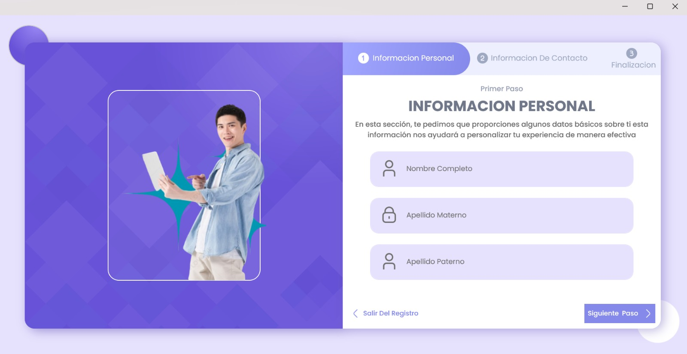

<!--proyect_tittle-->
# 🧠 Smart Schedule – Gestión Inteligente de Tareas con .NET MAUI

<!--proyect_image1_proyect_markdown/image1.png-->

---

<!--proyect_subtitle_description-->
## ✨ Descripción del Proyecto

<!--proyect_content_description-->
**Smart Schedule** es una aplicación móvil desarrollada con **.NET MAUI**, diseñada para ayudar a los usuarios a **organizar, priorizar y automatizar sus tareas diarias** de forma inteligente. La app ofrece una experiencia fluida y multiplataforma, con una interfaz moderna y funcionalidades pensadas para mejorar la productividad personal.

Desde el registro hasta la gestión de tareas, Smart Schedule guía al usuario con una interfaz clara y adaptable, permitiendo que cada persona configure su flujo de trabajo según sus necesidades.

---

<!--proyect_subtitle_objective-->
## 🎯 Objetivo del Proyecto

<!--proyect_content_objective-->
El objetivo principal de **Smart Schedule** es **simplificar la planificación diaria** mediante algoritmos de priorización, recordatorios inteligentes y categorización automática de tareas. La aplicación está pensada para estudiantes, profesionales y cualquier persona que busque una herramienta confiable para organizar su tiempo.

Además, al estar desarrollada en .NET MAUI, la app puede ejecutarse en Android, iOS, Windows y macOS con una sola base de código, lo que facilita su mantenimiento y escalabilidad.

---

<!--proyect_subtitle_functionality-->
## 🧩 Funcionamiento General

<!--proyect_content_functionality-->
La aplicación está compuesta por los siguientes módulos clave:

1. **Inicio de sesión:** Acceso seguro mediante credenciales, con validación en tiempo real y persistencia de sesión.  
2. **Registro de usuario:** Formulario guiado para capturar datos personales, preferencias de organización y sincronización.  
3. **Confirmación de registro:** Pantalla final que da la bienvenida al usuario y lo invita a comenzar a planificar sus tareas.

<!--proyect_image2_proyect_markdown/image2.png-->

<!--proyect_image3_proyect_markdown/image3.png-->

---

<!--proyect_subtitle_designUX-->
## 🖥️ Diseño y Experiencia de Usuario

<!--proyect_content_designUX-->
La interfaz de **Smart Schedule** está diseñada para ser minimalista, intuitiva y adaptable. Utiliza componentes nativos de .NET MAUI con estilos personalizados, animaciones suaves y retroalimentación visual clara. El flujo de usuario está optimizado para reducir fricción y facilitar la adopción desde el primer uso.

Cada pantalla está pensada para guiar al usuario paso a paso, con mensajes motivacionales y una estética profesional que refuerza la sensación de control y organización.

---

<!--proyect_subtitle_architecture-->
## 🏗️ Arquitectura Técnica

<!--proyect_content_architecture-->
El proyecto está construido sobre una arquitectura modular y multiplataforma:

- **Frontend móvil y de escritorio:**  
  - .NET MAUI  
  - MVVM para separación de lógica y presentación  
  - XAML para diseño de interfaces  

- **Persistencia local:**  
  - SQLite para almacenamiento de tareas  
  - Preferences para configuración de usuario  

- **Backend (futuro):**  
  - API RESTful para sincronización en la nube  
  - Notificaciones push y respaldo de datos

---

<!--proyect_subtitle_technologies-->
## 🔧 Tecnologías Utilizadas

<!--proyect_content_technologies-->
**Frontend:**
- .NET MAUI  
- XAML  
- MVVM Pattern  

**Persistencia:**
- SQLite  
- Preferences API  

**Backend (planeado):**
- ASP.NET Core  
- Azure / Firebase  
- REST API

---

<!--proyect_subtitle_contact-->
## 📬 Contacto

<!--proyect_content_contact-->
**Correo electrónico:**
- vielmassalais023@gmail.com  

**Teléfono:**
- +52 (81) 3233-1206  

**Redes Sociales:**
- GitHub: [@CesarVielmas](https://github.com/CesarVielmas)  
- LinkedIn: [Cesar Vielmas](https://www.linkedin.com/in/cesar-vielmas-324a9b218/)  

---

<!--proyect_subtitle_footer-->
## Smart Schedule

<!--proyect_content_footer-->
Organiza tu día con inteligencia y estilo 🧠📅  
**Última actualización:** 3 de septiembre de 2025
